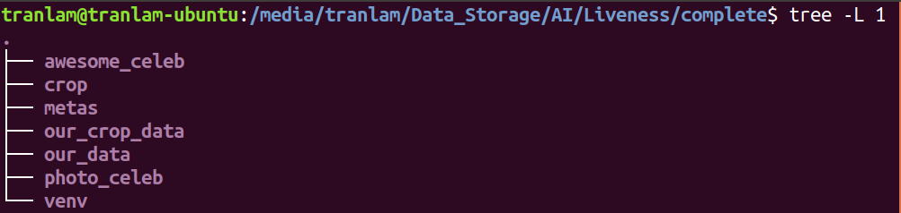
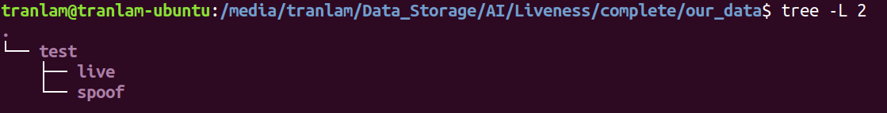

# awesome_celeb

## Data
- CelebA-Spoof [ECCV2020] A Large-Scale Face Anti-Spoofing Dataset

## Thư viện
Các thư viện được liệt trong `requirements.txt`.

## Sửa đường dẫn
Sửa 2 đường dẫn trong **config.py** như sau:
- `root` là đường dẫn đến tập dữ liệu Celeb được tải về.
- `base_dir` là đường dẫn đến folder muốn đặt môi trường làm việc.

Ví dụ dưới đây là sơ đồ `base_dir`, gồm folder `awesome_celeb` là folder chứa code của chúng ta, folder `metas` là folder label của mục label của chúng ta, `photo_celeb` là folder chứa ảnh đã cắt, `venv` là folder môi trường thư viện.

## Trích xuất ảnh photo từ tập celeb
Phần annotation detail của celeb, ta thấy rằng các ảnh in gồm (photo, poster, A4) nằm trong Spoof Type lần lượt là (1, 2, 3).Ta sẽ trích xuất các ảnh in đó để huấn luyện mô hình

Để chạy trích xuất ảnh, ta thực hiện các bước
- Thứ nhất: chạy `python EDABK_extract_from_celeb.py` để trích xuất ảnh photo, poster, A4 từ celeb.
- Thứ hai: sau khi chạy lệnh thứ nhất, ta có được tổng số ảnh photo, poster, A4 lấy từ celeb, khi này, ta sẽ mong muốn lấy một lượng ảnh live từ celeb tùy vào lượng ảnh spoof đã lấy được từ bước thứ nhất. Muốn lấy ảnh live từ celeb, thực hiện lần lượt các bước sau:
    - Vào **config.py**, sửa các biến `NUMBER_OF_LIVE_SAMPLES_TRAIN` là số ảnh live muốn lấy để train và `NUMBER_OF_LIVE_SAMPLES_TEST` là số ảnh live muốn lấy để test.
    - Chạy `python EDABK_get_live_samples.py` để lấy ảnh live.  
- Thứ hai: chạy `python EDABK_custom_data.py` để lấy label cho tập ảnh photo đã trích xuất.

## Tiền xử lý ảnh (cắt ảnh)
- Tập train: nếu ảnh bị lỗi, không đọc được, được thay bằng ảnh `/train_temp/006159_crop.jpg` với live example, `/train_temp/006485_crop.jpg` với spoof example.
- Tập test: nếu ảnh bị lỗi, không đọc được, được thay bằng ảnh `/test_temp/495823_crop.png` với live example, `/test_temp/501103_crop.png` với spoof example.
- Cắt ảnh train: `python make_crop_image.py train`
- Cắt ảnh test: `python make_crop_image.py test`

## Huấn luyện
- Có thể chỉnh sửa một số thông số trong **config.py**, chọn mạng backbone, batchsize, epoch,...
- Để huấn luyện mạng: `python main.py train`

## Kiểm thử
- Để kiếm thử mạng: `python main.py test`

## Xem lượng ảnh đã bị thay thế bằng 1 ảnh cứng nếu một số ảnh trong tập dữ liệu bị lỗi
- Sau khi chạy các thứ xong xuôi, ta xem danh sách các ảnh lỗi trong tập dữ liệu đã được thay bằng ảnh cứng
    - Các ảnh lỗi do quá trình cắt ảnh, trong file `broken_images/make_crop_image/broken.txt`.
    - Các ảnh lỗi do quá trình đọc ảnh cắt vào model, trong file `broken_images/require_dataset_crop/broken.txt` cho dữ liệu train và `broken_images/require_dataset_crop/broken_test.txt` cho dữ liệu test.
- Để xem lượng ảnh, thực hiện lần lượt
    - Chạy `python clear_duplicate_txt.py dir_to_txt_file` (với `dir_to_txt_file` là đường dẫn) cho 3 đường dẫn tới 3 loại broken text file được liệt kê bên trên. Ví dụ:
        `python clear_duplicate_txt.py "broken_images/make_crop_image/broken.txt"`
        `python clear_duplicate_txt.py "broken_images/require_dataset_crop/broken.txt"`
        `python clear_duplicate_txt.py "broken_images/require_dataset_crop/broken_test.txt"`
    Khi đó ta đã clear được hết các ví dụ bị lặp, khi này ta có thể vào hẳn file đó để xem các đường dẫn của ảnh lỗi.
    - Chạy `wc -l dir_to_txt_file` để đếm số ảnh trong các đường dẫn đó.

## Xem kết quả
- Xem kết quả trên tập validation: `cat result/val.txt`
- Xem kết quả trên tập test: `cat result/test.txt`

## Inference
- Chạy image inference: `python inference.py inference --image="path_to_image"`, đầu ra ảnh sau inference cũng chính ở trong folder ảnh được chạy inference, với tên ảnh đầu ra được thêm cụm `evaluated`.
- Chạy video inference: `python video_inference.py video_inference --video="path_to_video"`
- Chạy webcam inference: `python webcam_inference.py webcam_inference`

## Chạy testing với dữ liệu của ta
- Một số phần mới được thêm vào phục vụ cho việc test cần chú ý để tránh conflict khi pull.
    - Thêm các đường dẫn mới vào `config.py`
    - Thêm 2 folder `our_test_temp` và `our_train_temp`
    - Thêm file `data/require_our_data.py`
    - Thêm file `make_crop_our_data.py`
- Chuẩn bị dữ liệu test.
    - Tạo một folder tên `our_data` tại đường môi trường làm việc là `base_dir` ở các mục đầu
        
    Trong folder `our_data` này, ta triển khai đặt các folder live và spoof như sau
        
    Folder live chứa các ảnh thật, folder spoof chứa các ảnh giả mạo.
- Cắt ảnh test: `python make_crop_our_data.py test`
- Trong file `main.py`, ở hàm `def test_our_data(**kwargs)` chỉnh dòng `pths = glob.glob('checkpoints-photo-celeb/%s/*.pth' % (opt.model))` cho phù hợp để nó trỏ đến folder checkpoints của ta.
- Chạy test: `python main.py test_our_data`