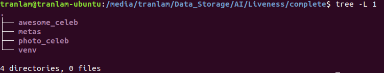
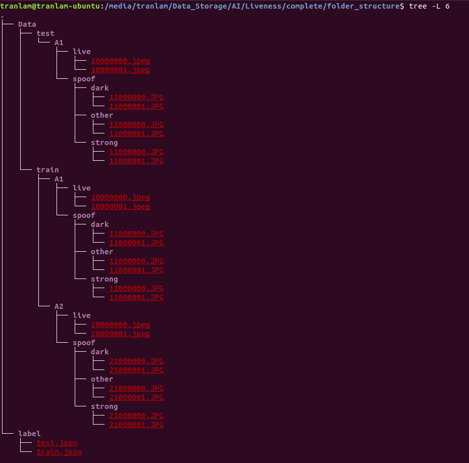
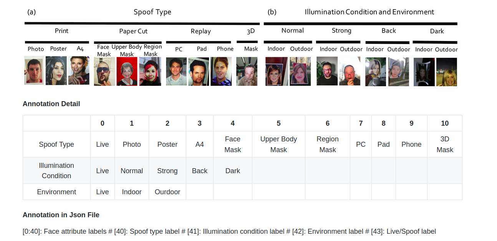

# awesome_celeb

## Data
- CelebA-Spoof [ECCV2020] A Large-Scale Face Anti-Spoofing Dataset

## Thư viện
Các thư viện được liệt trong `requirements.txt`.

## Sửa đường dẫn
Sửa 2 đường dẫn trong **config.py** như sau:
- `root` là đường dẫn đến tập dữ liệu Celeb được tải về.
- `base_dir` là đường dẫn đến folder muốn đặt môi trường làm việc.

Ví dụ dưới đây là sơ đồ `base_dir`, gồm folder `awesome_celeb` là folder chứa code của chúng ta, folder `metas` là folder label của mục label của chúng ta, `photo_celeb` là folder chứa ảnh đã cắt, `venv` là folder môi trường thư viện.

## Tổ chức dữ liệu của ta
- Tại folder môi trường làm việc `base_dir`, ta đặt folder dữ liệu của ta tên là `our_data` có cấu trúc như sau

**Chú ý:** Cần kiểm tra đúng thứ tự các ảnh (ảnh trực diện -> ảnh góc 12h -> ảnh góc 3h -> ảnh góc 6h -> ảnh góc 9h) trong các folder live và spoof, có thể trong quá trình di chuyển ảnh bị mất mát một số ảnh, nhưng, code chỉ chạy đúng nếu như thứ tự các ảnh đúng.
- Đổi tên ảnh train: `python EDABK_change_filenames.py train`
- Đổi tên ảnh test: `python EDABK_change_filenames.py test`

## Trích xuất ảnh photo từ tập celeb
Phần annotation detail của celeb, ta thấy rằng các ảnh in gồm (photo, poster, A4) nằm trong Spoof Type lần lượt là (1, 2, 3).Ta sẽ trích xuất các ảnh in đó để huấn luyện mô hình

Để chạy trích xuất ảnh, ta thực hiện các bước
- Thứ nhất, vì lượng dữ liệu hiện có của ta còn ít, nên ta có thể cân nhắc lấy hết hoặc chỉ lấy một phần của CelebA-Spoof
    - Vào **config.py**, sửa các biến `GET_ALL_CELEB_PHOTO` thể hiện cho việc có lấy tất cả dữ liệu photo hay không, nếu không, cần phải sửa các biến `NUMBER_OF_PHOTO_TRAIN`, `NUMBER_OF_PHOTO_TEST`, `NUMBER_OF_POSTER_TRAIN`, `NUMBER_OF_POSTER_TEST`, `NUMBER_OF_A4_TRAIN`, `NUMBER_OF_A4_TEST` thể hiện lượng ảnh photo mà ta muốn lấy ở CelebA-Spoof.
    - Chạy `python EDABK_extract_photo_celeb.py` để trích xuất ảnh photo, poster, a4 từ CelebA-Spoof.
- Thứ hai: sau khi chạy lệnh thứ nhất, ta có được tổng số ảnh photo, poster, A4 lấy từ celeb, khi này, ta sẽ mong muốn lấy một lượng ảnh live từ celeb tùy vào lượng ảnh spoof đã lấy được từ bước thứ nhất. Muốn lấy ảnh live từ celeb, thực hiện lần lượt các bước sau:
    - Vào **config.py**, sửa các biến `NUMBER_OF_LIVE_SAMPLES_TRAIN` là số ảnh live muốn lấy để train và `NUMBER_OF_LIVE_SAMPLES_TEST` là số ảnh live muốn lấy để test.
    - Chạy `python EDABK_get_live_samples.py` để lấy ảnh live.  
- Thứ ba: chạy `python EDABK_custom_data.py` để lấy label cho tập ảnh photo đã trích xuất.

*----------------REPLAY----------------*

Để chạy trích xuất ảnh, ta thực hiện các bước
- Thứ nhất, vì lượng dữ liệu hiện có của ta còn ít, nên ta có thể cân nhắc lấy hết hoặc chỉ lấy một phần của CelebA-Spoof
    - Vào **config.py**, sửa các biến `GET_ALL_CELEB_REPLAY` thể hiện cho việc có lấy tất cả dữ liệu replay hay không, nếu không, cần phải sửa các biến `NUMBER_OF_PC_TRAIN`, `NUMBER_OF_PC_TEST`, `NUMBER_OF_PAD_TRAIN`, `NUMBER_OF_PAD_TEST`, `NUMBER_OF_PHONE_TRAIN`, `NUMBER_OF_PHONE_TEST` thể hiện lượng ảnh replay mà ta muốn lấy ở CelebA-Spoof.
    - Chạy `python EDABK_extract_replay_celeb.py` để trích xuất ảnh PC, Pad, Phone từ CelebA-Spoof.
- Thứ hai: sau khi chạy lệnh thứ nhất, ta có được tổng số ảnh PC, Pad, Phone lấy từ celeb, khi này, ta sẽ mong muốn lấy một lượng ảnh live từ celeb tùy vào lượng ảnh spoof đã lấy được từ bước thứ nhất. Muốn lấy ảnh live từ celeb, thực hiện lần lượt các bước sau:
    - Vào **config.py**, sửa các biến `NUMBER_OF_LIVE_SAMPLES_TRAIN` là số ảnh live muốn lấy để train và `NUMBER_OF_LIVE_SAMPLES_TEST` là số ảnh live muốn lấy để test.
    - Chạy `python EDABK_get_live_samples.py` để lấy ảnh live.  
- Thứ ba: chạy `python EDABK_custom_replay.py` để lấy label cho tập ảnh photo đã trích xuất.

## Tiền xử lý ảnh (cắt ảnh)
- Tại folder code, gõ `make` để compile các file cần thiết.
- Tải params và json của resnet50 pretrained [TẠI ĐÂY](https://www.dropbox.com/s/53ftnlarhyrpkg2/retinaface-R50.zip?dl=0). Đặt 2 file `R50-0000.params` và `R50-symbol.json` vào folder `model/` tại folder code.
- Tập train: nếu ảnh bị lỗi, không đọc được, được thay bằng ảnh `/our_train_temp/live.jpeg` với live example, `/our_train_temp/spoof.jpg` với spoof example.
- Tập test: nếu ảnh bị lỗi, không đọc được, được thay bằng ảnh `/our_test_temp/live.jpeg` với live example, `/our_test_temp/spoof.jpg` với spoof example.
- Cắt ảnh train: `python make_crop_data.py train`
- Cắt ảnh test: `python make_crop_data.py test`
- **Đặc biệt chú ý:** khi chạy code, nếu các dòng print có nhắc đến vấn đề out of memory của GPU, hãy dừng code.

*----------------REPLAY----------------*

- Cắt ảnh train: `python make_crop_data_replay.py train`
- Cắt ảnh test: `python make_crop_data_replay.py test`
- **Đặc biệt chú ý:** khi chạy code, nếu các dòng print có nhắc đến vấn đề out of memory của GPU, hãy dừng code.

## Huấn luyện
- Có thể chỉnh sửa một số thông số trong **config.py**, chọn mạng backbone, batchsize, epoch,...
- Để huấn luyện mạng: `python main.py train`

*----------------REPLAY----------------*

- Để huấn luyện mạng: `python main_replay.py train`

## Kiểm thử
- Để kiếm thử mạng: `python main.py test`

*----------------REPLAY----------------*

- Để kiếm thử mạng: `python main_replay.py test`

## Xem lượng ảnh đã bị thay thế bằng 1 ảnh cứng nếu một số ảnh trong tập dữ liệu bị lỗi
- Sau khi chạy các thứ xong xuôi, ta xem danh sách các ảnh lỗi trong tập dữ liệu đã được thay bằng ảnh cứng
    - Các ảnh lỗi do quá trình cắt ảnh, trong file `our_broken_images/make_crop_image/broken.txt`.
    - Các ảnh lỗi do quá trình đọc ảnh cắt vào model, trong file `our_broken_images/require_dataset_crop/broken.txt` cho dữ liệu train và `our_broken_images/require_dataset_crop/broken_test.txt` cho dữ liệu test.
- Để xem lượng ảnh, thực hiện lần lượt
    - Chạy `python clear_duplicate_txt.py dir_to_txt_file` (với `dir_to_txt_file` là đường dẫn) cho 3 đường dẫn tới 3 loại broken text file được liệt kê bên trên. Ví dụ:
        `python clear_duplicate_txt.py "our_broken_images/make_crop_image/broken.txt"`
        `python clear_duplicate_txt.py "our_broken_images/require_dataset_crop/broken.txt"`
        `python clear_duplicate_txt.py "our_broken_images/require_dataset_crop/broken_test.txt"`
    Khi đó ta đã clear được hết các ví dụ bị lặp, khi này ta có thể vào hẳn file đó để xem các đường dẫn của ảnh lỗi.
    - Chạy `wc -l dir_to_txt_file` để đếm số ảnh trong các đường dẫn đó.

## Xem kết quả
- Xem kết quả trên tập validation: `cat result/val.txt`
- Xem kết quả trên tập test: `cat result/test.txt`

## Inference
Trước tiên trong các file `inference.py`, `video_inference.py`, `webcam_inference.py` này, ta phải sửa đường dẫn đến checkpoints của model chúng ta
- Chạy image inference: `python inference.py inference --images="path_to_images_folder" --spoof_threshold=0.5`, đầu ra ảnh sau inference cũng chính ở trong folder ảnh được chạy inference, với tên ảnh đầu ra được thêm cụm `evaluated`. Trong đó, `spoof_threshold` sẽ là ngưỡng mà mình quyết định mặt đó là spoof hay live. Ví dụ: `python inference.py inference --images="/media/tranlam/Data_Storage" --spoof_threshold=0.5`
- Chạy video inference: `python video_inference.py video_inference --video="path_to_video"`
- Chạy webcam inference: `python webcam_inference.py webcam_inference`
